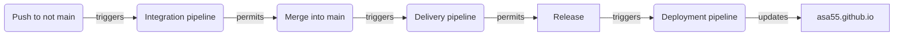

 |  | 
--- | --- | ---

## Deployment workflow

```mermaid
flowchart LR
    id1(Push to not main)-- triggers -->id2(Integration pipeline)-- permits -->id3(Merge into main)-- triggers -->id4(Delivery pipeline)-- permits -->Release-- triggers -->id6(Deployment pipeline)-- updates -->asa55.github.io
```
