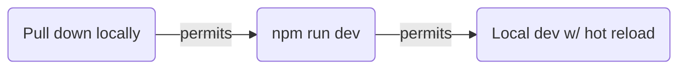
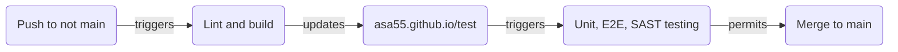
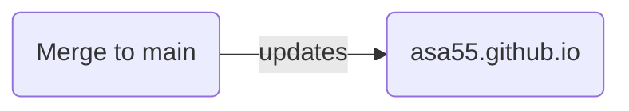

 

## ℹ️ Dev dependencies

Not limited to this, it's what I'm using:

* **OS** Win11 (22H2)
  * **software manager** Chocolatey
    * **editor** VSCode
    * **version control** git
    * **dev server** NodeJS
      * **frontend framework** React
      * **lang/compatibility** Typescript
      * **task runner** NPM scripts
      * **module bundler** Vite
      * **CSS framework** Bulma

Thing I considered but tabled:

* GitHub CodeSpaces
  * Needs to target a specific branch - I'd need a long running dev branch or develop on main
    * I'd prefer to continue to use feature branching but might revisit the former option. The latter option is ruled out as it breaks a number of assumptions made for my CI/CD pipelines as well as branch protections in place on main.
* Containerize my local development environment
  * I have Docker locally and am interested in trying Podman + Buildah
    * I already have dev tools on my desktop and taking the time to start the containerized environment needs to be worth the added friction of using it in my local development workflow. This site is a simple frontend, not microservices and not requiring a particularly unique environment to run. The deployment is not containerized, and there's not much of a reason to in this case anyway. I'm not using advanced logging or monitoring techniques on the app, so I don't need a sidecar for example which would be one reason to consider containerized deployments. Aside from exercising the capability (which many of my decisions have been motivated by to be fair) I don't have many compelling reasons to use containers in my local development flow currently.

## ℹ️ Development workflow

## ℹ️ Integration workflow

## ℹ️ Deployment workflow

## ℹ️ Security

* Branch protection rule on main requries passing status for CodeQL scan prior to merge
* Dependabot is enabled
* GitHub Secrets are used for repo secrets

## ℹ️ Testing

* Unit (vitest), E2E (Playwright), SAST (CodeQL) tests are part of CI pipeline
* E2E testing happens on the asa55.github.io/test endpoint, before changes make their way to asa55.github.io

## ℹ️ License

Source code is MIT, all rights reserved for site content. In plain language, feel free to use anything except information about me.
