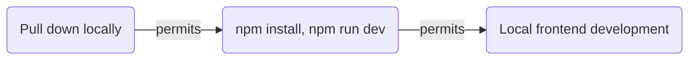
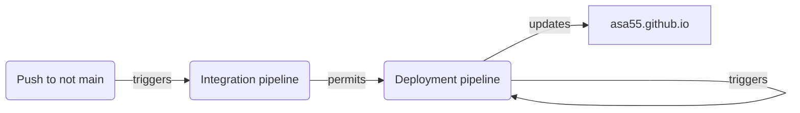

 |  | 
--- | --- | ---

## Development environment

* Win11
  * Chocolatey
    * VSCode
    * git
    * NodeJS

## Development workflow

## Deployment workflow

## Notes on security

* Branch protection rule on main requries passing status for CodeQL code scan prior to merge
* Dependabot is enabled
* GitHub Secrets are used for repo secrets

## Notes on testing

* Unit and E2E tests are part of CI pipeline
* Unit tests via vitest
* E2E via Playwright

## Notes on license

Source code is MIT, all rights reserved for site content. In other words, feel free to use code snippets but remove any information about me.