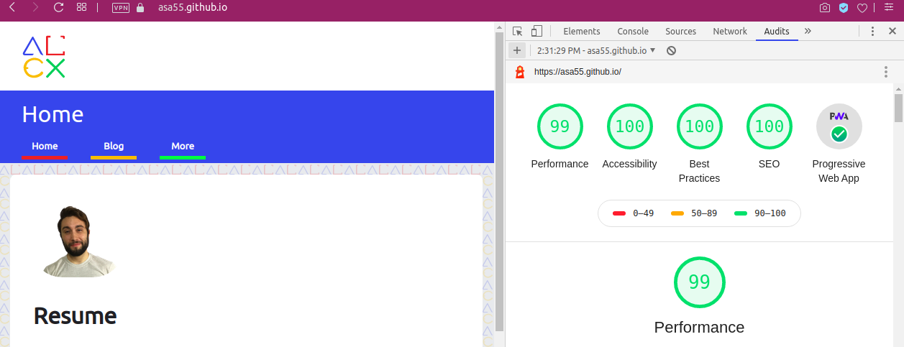
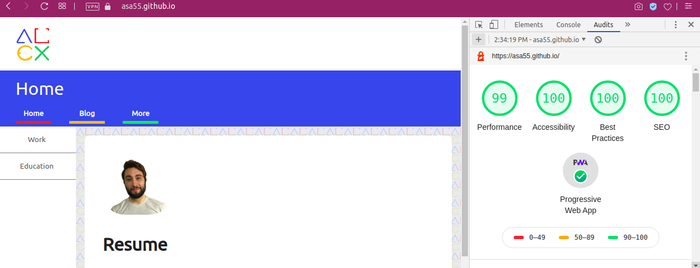
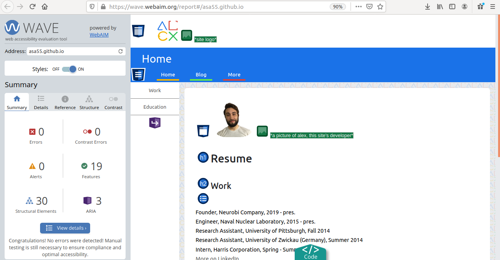
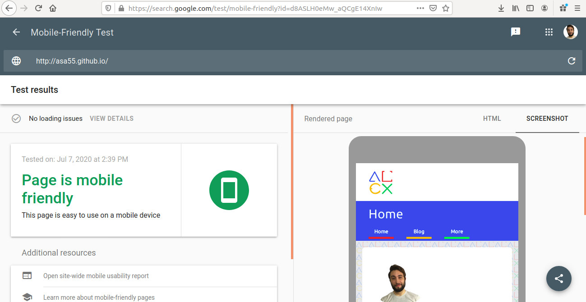

# Check out [my GitHub Pages site (asa55.github.io)](https://asa55.github.io)!

## Dev Environment
While building this site, I used VSCode, live-server, sass --watch, and Firefox / Opera browsers on Ubuntu Linux). A containerized dev environment was considered but decided it was overkill. CI/CD with automated build and test was considered, but also deemed overkill.

## Design Considerations:
As of a few commits ago, I started using a branch-and-merge workflow. It's a clean, lightweight branching strategy and in the case of this site it's a workflow improvement.
The site is designed as a simple Single Page App (SPA) using vanilla JS. I show and hide DOM elements that load when you first go to the site. This design choice means everything is sitting in memory - it puts initial load time at risk, but I made this choice conscientiously which is why the site is lightweight (even most of my images are SVG instead of compressed png - their memory cost is next to nothing). This makes page load and navigation lightning fast. A minimal amount of SCSS and JS was used intentionally as well - if I wanted to go any more complex than this I'd be reaching for React.JS and CSS-in-JS instead of vanilla JS and only a small step up from vanilla CSS.
All of that being said, the last point I want to keep in mind is that each page should have a unique URL. Lighthouse leaves this as a manual check. My SPA design doesn't do this by default, so I need to sit and think about the best way to make this happen.
Last note: I recently implemented service workers. I don't have a EU audience, but I need to check to see if service workers require some sort of cache notification for GDPR compliance. I don't expect it to apply to my users, but it's courteous to add it anyway.

## Accessibility Considerations:
This site was designed with [accessibility (a11y)](https://developer.mozilla.org/en-US/docs/Learn/Accessibility/What_is_accessibility) in mind. Tab navigation, color contrast, semantic HTML tags, and alternate descriptions are built in. In addition, this site:
* Passed the [webaim test](https://wave.webaim.org/report#/asa55.github.io) with zero errors
* Passed the [Google Mobile Friendly Test](https://search.google.com/test/mobile-friendly?id=d8ASLH0eMw_aQCgE14XnIw) with zero errors
* Lighthouse desktop and mobile tests both show the site is a valid PWA with a 99 performance rating and 100 in all other categories

See the below screenshots for details:

