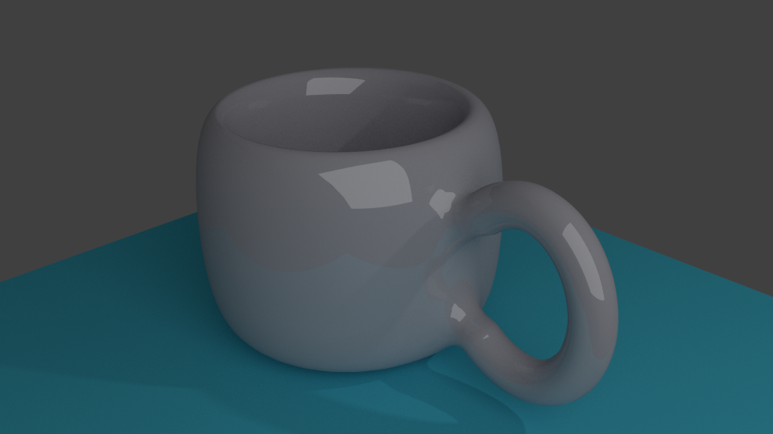

# Some of my work in Blender was for artistic rendering, and some was strictly for 3D printing.

## To see an example of my use of Blender for 3D printing, check out [this status report I sent my prof during a self study class I designed in grad school.](https://www.dropbox.com/s/alrs82bqx5ndvv3/CartPoleProject_Update08202017.pdf?dl=0)

## An example of some pretty rendering work I did is in the image below. I find it simple, yet beautiful. 